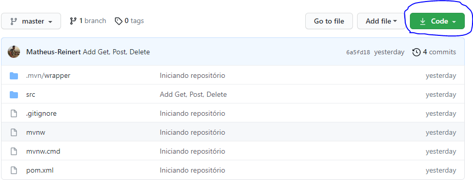
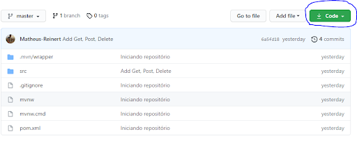
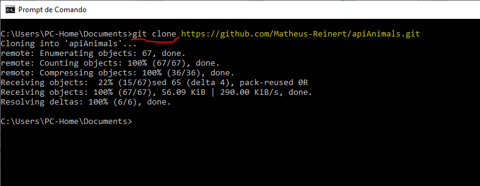
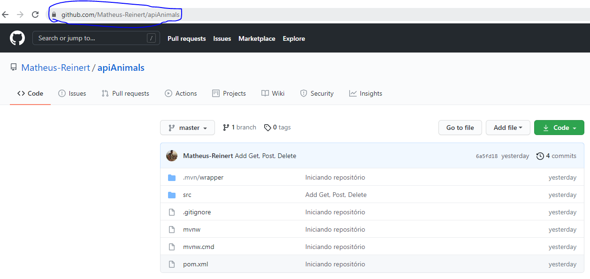
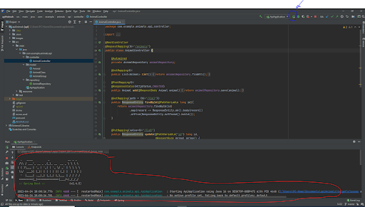
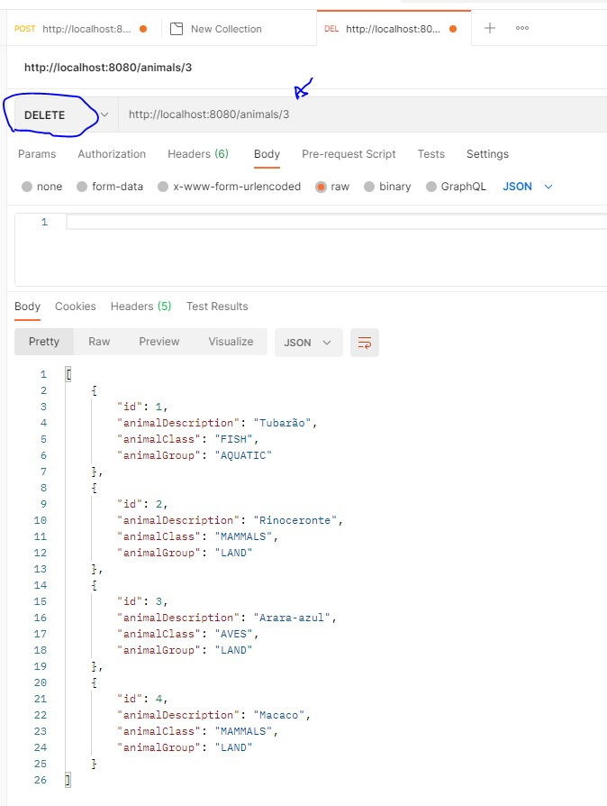
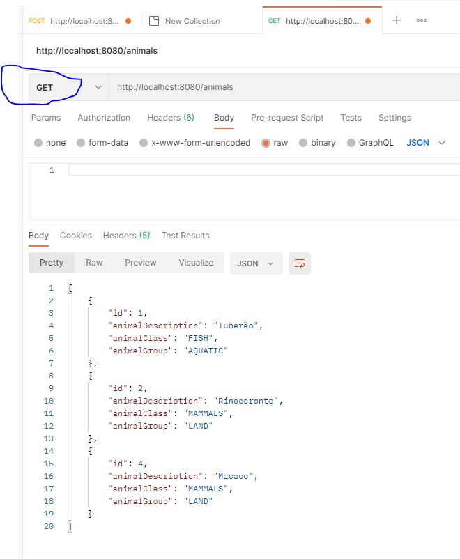

# apiAnimals

# Fazendo o download

### Como baixar a aplicação do Github para sua máquina.
1 - clique no botão verde circulado de azul conforme a imagem abaixo:

2 - Aparecerá uma lista de opções conforme ilusta a imagem abaixo, clique em download, para que seja feito o download zip.

Outra forma de ter a aplicação em sua máquina é fazendo o clone,
mas para isso é necessário que se tenha o programa de controle de versionamento de código instalado em sua máquina. caso ainda não tenha instalado em sua máquina clique em: [DownloadGit](https://git-scm.com/)

# Clonando o repositório.

1 - Com git já instalado, copie o link referente ao projeto clicando apenas no botão que se parece com uma prancheta, apontado pela seta azul.

2 - Abra o seu terminal Shell bash do git, ou seu prompt de comando - CMD.  

2.1 - Navegue até a pasta que deseja colocar o repositório e dê o comando 
git clone (destacado em vermelho), em seguida cole o link copiado do projeto no github conforme ilustra a figura abaixo e tecle enter.

É possível também usar o link do projeto da URL de navegação, conforme ilustra a imagem abaixo destacado em azul, ao invés de usar o link do botão parecido com uma prancheta conforme citado logo acima, e é o mesmo procedimento para clonar usando o terminal.

Pronto, agora que você já tem o repositório salvo em sua máquina, agora vamos aos testes de execução!

Obs: para isso é preciso ter um editor de código IDE compativel com java instalada em sua máquina,  Para saber mais sobre o que é uma IDE, clique no link [redhat linux]( https://www.redhat.com/pt-br/topics/middleware/what-is-ide).

# Executando a aplicação

1 - Abra a aplicação que você fez o download ou clone com a IDE, nesse exemplo estou usando o InteliJ.

Obs 1: caso não tenha o Intelij instalado, você pode esta usando a versão Community que é uma versão gratuita para isso clique em: [Download InteliJ](https://www.jetbrains.com/pt-br/idea/download/#section=windows).
 

Obs 2 : é necessário que se tenha o JDK instalado em sua máquina, caso não tenha o JDK 
instalado clique em: [Download JDK](https://www.oracle.com/br/java/technologies/javase-jdk11-downloads.html) para baixar e instalar o JDK compatível com seu sistema operacional;  para saber mais sobre o que é uma JDK acesse o link da [Devmedia]( https://www.devmedia.com.br/introducao-ao-java-jdk/28896)

2 - Após instalado as ferramentas abra o InteliJ e dê o play para subir a aplicação, clicando no botão conforme circulado e apontado pela seta azul, e verá o status no terminal, "área circulada em vermelho no rodapé", se estiver tudo Ok, você verá algo parecido com o o apresentado na figura logo abaixo.

## Agora utilizaremos o Postman para testar a nossa aplicação.

O que é o Postaman?

O Postaman é uma ferramenta que permite realizar requisições HTTP para testar APIs RESTs e pode ser usada com extenção no navegador Google Chrome ou instalação direta no PC); para saber mais  sobre o Postaman clique em: [Enotas](https://enotas.com.br/blog/postman/).

Para download e instalação no PC clique em: [Download postman](https://www.postman.com/downloads/).

# COMO UTILIZAR O "DELETE"

Para deletar um animal, selecione a opção DELETE e inclua na URL um / com a posição do animal que pretende excluir. Exemplo: https.../3

## Veja abaixo:  (Não esqueça de pressionar o enter após a instrução)

Logo após, selecione a opção GET e confira sua execução feita com sucesso.

 
